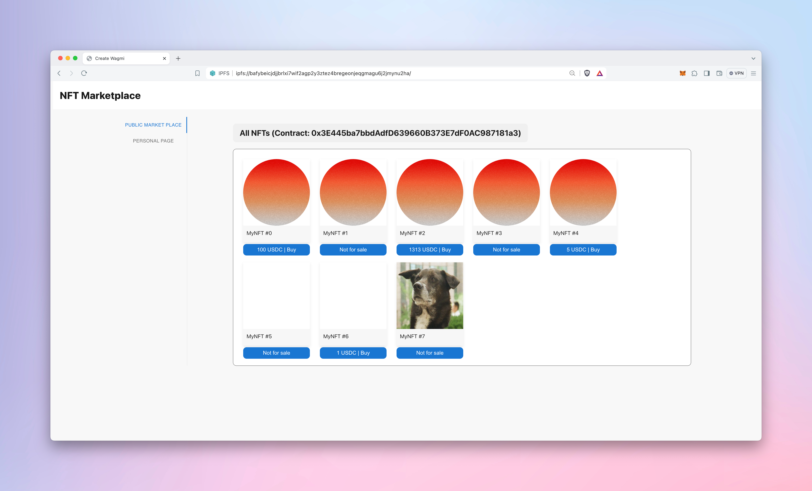
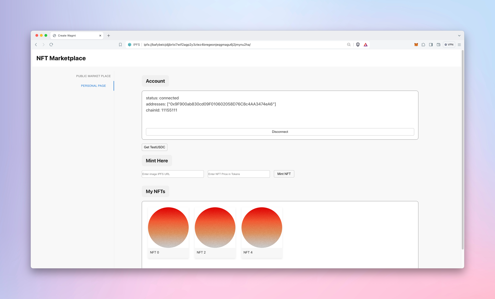

# NFTMarket

## Group Member
- Zhengyu Chen
- Hao-Wei Kao
- Bote Wang

## IPFS URL
https://ipfs.io/ipfs/QmTG1kRzYEwQVeeECNjUWqwjcQJvArSsjDPUs5mzh4ECYo

### Contract Repo
https://github.com/neu-info7500-spring-04/MyNFTContract

### Contract link
- ERC721 contract: https://sepolia.etherscan.io/address/0x3E445ba7bbdAdfD639660B373E7dF0AC987181a3
- ERC20 contract: https://sepolia.etherscan.io/address/0x49fBFE1517b34D9eFd01F9e37A9400B2e00AA376

### Project Part B
**Add-on Function:** ERC20 payments: Allow users to pay for NFT’s using ERC20 tokens.
**Screenshots:**

